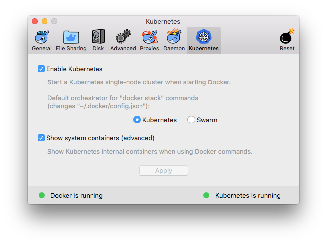
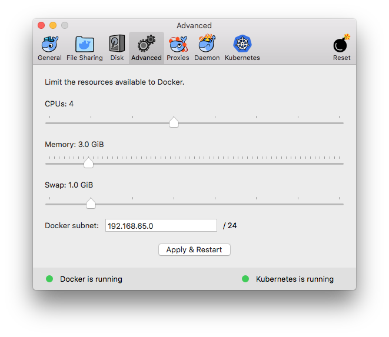
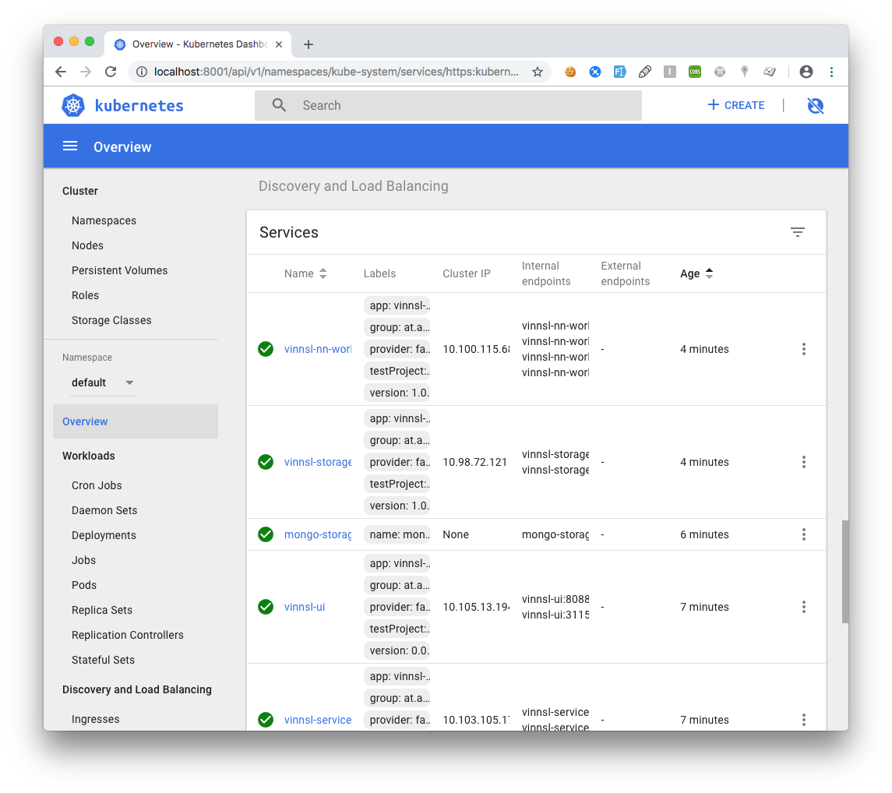

# Setting up on local machine with Docker CE

## Prerequisites

- Docker Edge (Kubernetes enabled)

- Allow Docker to allocate to 3GB memory or higher

   

- kubectl installed (https://kubernetes.io/docs/tasks/tools/install-kubectl/#install-kubectl)

- Port 80 and 443 must be free to use, no other services should be running on these ports

## Set up

### Setup Services

cd into folder /deploy/local_dockerce

```bash
kubectl apply -f mongo_small.yaml
kubectl apply -f vinnsl-service.yaml
kubectl apply -f vinnsl-nn-ui.yaml
kubectl apply -f mongo-storage-service.yaml
kubectl apply -f vinnsl-storage-service.yaml
kubectl apply -f vinnsl-nn-worker.yaml
```

### Check if Services are up

#### Enable Kubernetes Dashboard

```
kubectl create -f https://raw.githubusercontent.com/kubernetes/dashboard/master/src/deploy/recommended/kubernetes-dashboard.yaml
```

#### Open Dashboard

```
kubectl proxy
```

Open in Browser: http://localhost:8001/api/v1/namespaces/kube-system/services/https:kubernetes-dashboard:/proxy/#!/overview?namespace=default

#### Check Services

All Services should be deployed and ready



### Enable Service Discovery with Ingress

#### Enable Ingress for DockerCE

```bash
kubectl apply -f https://raw.githubusercontent.com/kubernetes/ingress-nginx/master/deploy/mandatory.yaml

kubectl apply -f https://raw.githubusercontent.com/kubernetes/ingress-nginx/master/deploy/provider/cloud-generic.yaml
```

#### Configure Ingress

```
kubectl apply -f ingress.yaml
```

After a few minutes 

```
kubectl get ing
```

should return

```
NAME              HOSTS     ADDRESS     PORTS     AGE
cluster-ingress   *         localhost   80        2m
```

You can now open your browser: https://localhost/#/ and should see the Vinnsl-NN-UI

## Use ConbexNN

After successful setup should be able to open the following endpoints in your browser:

https://localhost + endpoint

| endpoint        | Service                           |
| --------------- | --------------------------------- |
| /#/             | Vinnsl NN UI                      |
| /vinnsl         | Vinnsl Service                    |
| /status         | Vinnsl NN Status                  |
| /worker/queue   | Worker Queue                      |
| /storage        | Storage Service                   |
| /train/overview | DL4J Training UI (while training) |

 