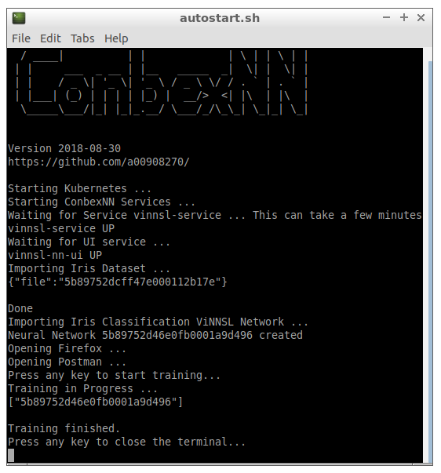
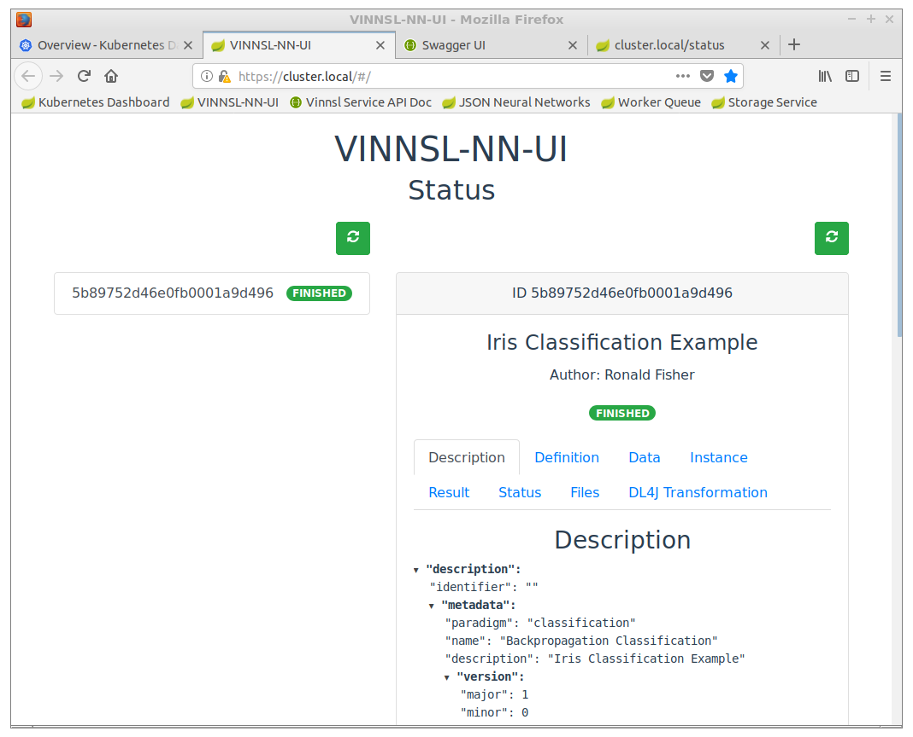
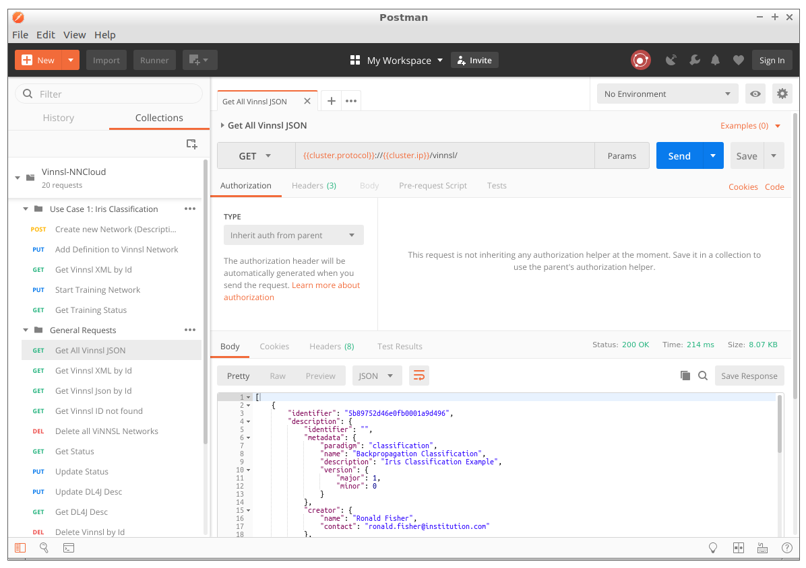

# Container Based Execution Stack for Neural Networks (ConbexNN)
This a project features web services to train and evaluate neural networks using the Kubernetes container orchestration and a Java based microservice architecture. 

## Demo VM
See the project in Action by running a virtual machine. It comes preconfigured with Kubernetes running all necessary ConbexNN services and a neural network training set for testing.

You can try out the RESTful API and GUI.

## Specs

* Format: OVA 
* Size: 4.3 GB
* System Lubuntu 18.04.1 64bit
* Recommended RAM: 3GB
* Required disk space: 15 GB

Tested with VirtualBox 5.2.18 r124319 on macOS 10.13.6

### Download

[Download here](https://conbexvm.blob.core.windows.net/conbexvm/ConbexNN.ova)

### Import
In VirtualBox click
* File / Import Appliance
* Select the .ova file and start the import
* the machine can be started now

### Credentials

* User: `conbexnn`
* Password: `conbexnn`

## Features 
### Startup

After Login the VM starts `autostart.sh` initalizing ConbexNN. The Iris testset and a ViNNSL neural network are automatically imported.

### Browser

Firefox is preinstalled and opens predefined Tabs

* Kubernetes Dashboard
* VINNSL-NN-UI (user interface showing imported neural networks)
* Swagger API (documentation of the ConbexNN RESTful interface)
* Status Tab (shows status of imported neural networks)

### Postman

Postman comes also preinstalled with the VM and contains a collection of requests supported by ConbexNN. You can view all neural networks, create new ones, start training, …

